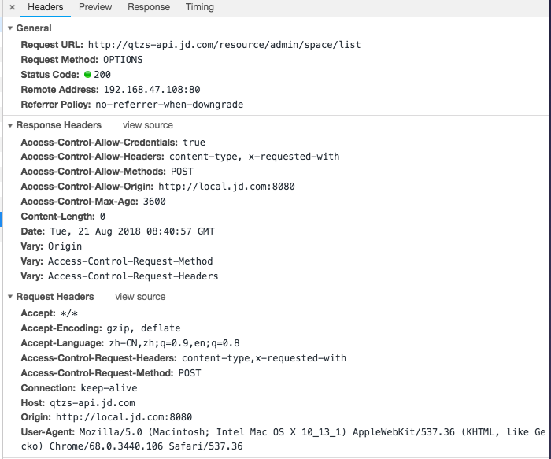
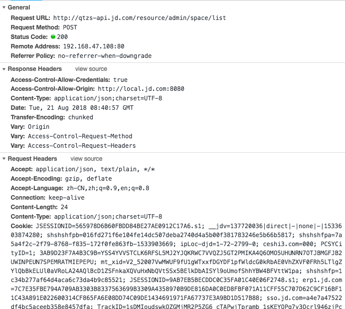
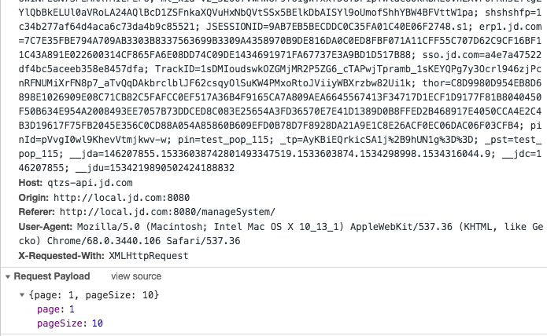

### options 
* “需预检的请求”要求必须首先使用 OPTIONS   方法发起一个预检请求到服务器，以获知服务器是否允许该实际请求。
* "预检请求“的使用，可以避免跨域请求对服务器的用户数据产生未预期的影响。

#### 当请求满足下述任一条件时，即应首先发送预检请求：

1. 使用了下面任一 HTTP 方法：

	* PUT
	* DELETE
	* CONNECT
	* OPTIONS
	* TRACE
	* PATCH
	
2. 人为设置了对 CORS 安全的首部字段集合之外的其他首部字段。该集合为：
   * Accept
   * Accept-Language
   * Content-Language
   * Content-Type (but note the additional requirements below)
	* DPR
	* Downlink
	* Save-Data
	* Viewport-Width
	* Width

 	ps :Content-Type 的值不属于下列之一:
		* application/x-www-form-urlencoded
		* multipart/form-data
		* text/plain
3. 请求中的XMLHttpRequestUpload 对象注册了任意多个事件监听器。
4. 请求中使用了ReadableStream对象。

附上项目接口的截图

